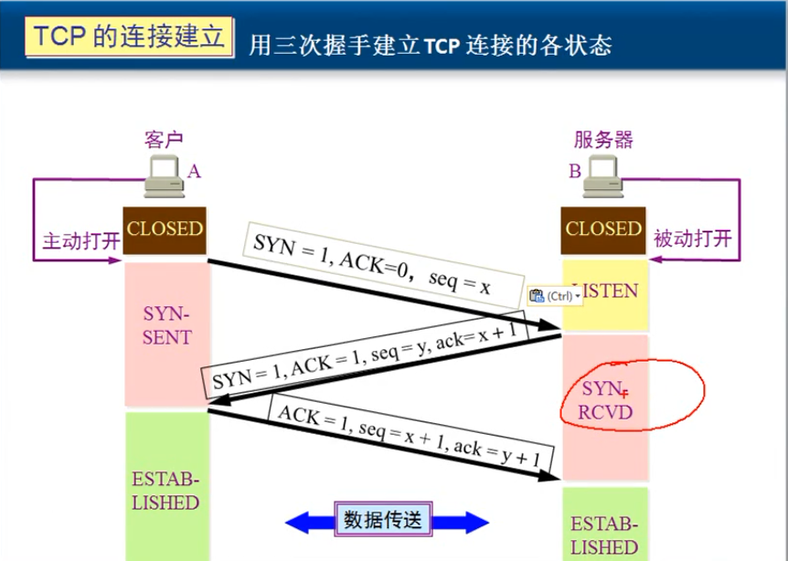
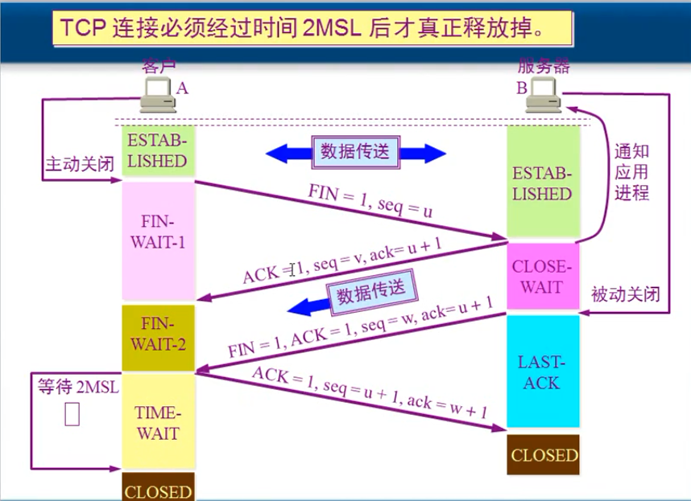
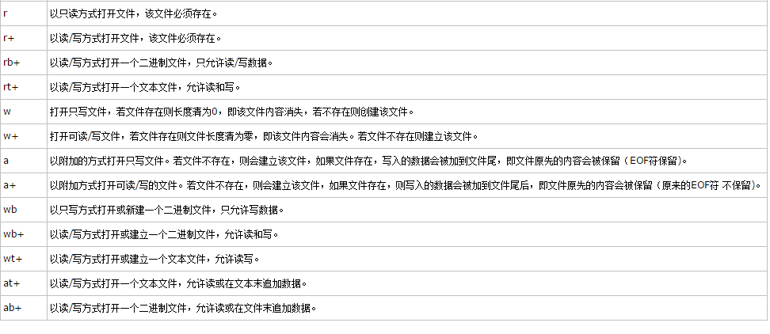

## Linux 错题本本

1、文件系统权限

- r：读取权限，4
- w：写权限，2
- x：执行权限，1

常见组合：

- 7（4 2 1）：对文件拥有者所能执行的操作
- 6（4 2   ）：可读、可写
- 5（4 1   ）：可读、可执行
- 4（4      ）：可读
- 3（  2  1）：可写、可执行
- 2（  2    ）：可写
- 1（      1）：可执行

2、文件系统中的文件类型：

- -：表示文件
- d：表示文件夹（document）
- l：表示链接（link）

3、局部变量放在栈中，堆中放的是new和malloc开辟出来的，而程序中定义的常量存放在只读存储器中。

4、使用 `rsync` 命令来同步两台服务器上的日志。

5、 crontab 文件由6个域组成，每个域之间用空格分割，具体的格式为：`MIN HOUR DAY MONTH DAYOFWEEK COMMAND` 。

crontab文件的格式：`M H D m d cmd` 。

- M：MIN
- H：HOUR
- D：DAY
- m：MONTH
- d：DAYOFFWEEK
- cmd：COMMAND

6、对于文件的访问权限可以直接使用 `chmod 777  exer` 方式，可以使用：`chmod a+x,g+w exer1`

`chmod  [who] [+|-|=] [mode]  文件名`

- u：表示用户（user），即文件或目录的所有者
- g：表示同组用户（group），即与文件属主有相同组ID的所有用户
- o：表示其他用户（others）
- a：表示所有用户（all），它是系统的默认值

操作符：

- +：添加某个权限
- -：取消某个权限
- =：赋予给定权限并取消其他所有权限

7、对于`swap` 分区，在内存小于2G的情况下，交换分区应为内存的2倍，超过2G的时候，交换分区为物理内存加上2G。

8、搜索文件

- `find` 是根据 name，ctime，mtime等信息搜索文件的命令，不会根据文件内容去检索，也就是他只利用了INode的信息，

- 使用`grep `命令需要加上 `-R` 或 `-r` 表示递归查询子目录，`-n` 表示显示行号信息。

9、权限设置：

- 文件的默认权限是 `666`
- 文件夹的默认设置是 `777`
- 设 umask 为 002，则新建的文件的权限是 664 ，新建的文件夹是 775
- 当你在系统中创建一个文件或者目录的时候，如果你不进行任务的设置，总会有一个默认的权限，这个默认的权限就有`umask`来设置，配置文件的位置在`/etc/profile` 里面的
- 创建的目录或文件的默认权限是umask的反码，但是这里要注意的
  - 对于新创建的文件，文件在创建初期是不具有执行权限的，所以在创建文件的默认权限是umask取反之后执行权限rwx的x对应的位置置0。
  - 对于新创建的目录，其默认的权限就是umask的取反操作

10、使用 `echo $(pwd)` 命令来显示当前目录。

11、线程访问内存非法时，当前线程会进入信号处理函数

- `ulimit` ：用于shell启动进程所占用的资源，-c  size：设置core文件的最大单位：blocks

- `malloc` ：叫做动态内存分配，当无法知道内存具体的位置的时候，想要绑定真正的内存空间，就需要用到动态的分配内存。
- `malloc` 是 `glibc` 里的库函数，他封装了一些像系统申请内存的系统调用，并不是每次都使用malloc的时候都会想系统申请新的内存。

12、查看当前系统的启动时间：

- w
- top
- uptime

ps：查看当前系统的进程

who -b：当前系统的启动时间

last reboot：当前系统的启动时间

w：查看当前系统的启动时间

top：查看当前系统的启动时间

uptime：查看当前系统的启动时间

13、在Linux系统中，与用户管理相关的配置文件：

`/etc/group`：设定用户的组名与相关信息

`/etc/passwd`：账号信息

`/etc/shadow`：密码信息

14、通信方式：

Linux 进程间通信：管道、信号、消息队列、共享内存、信号量、套接字

Linux 线程间通信：互斥量（mutex），信号量，条件变量

Windows进程间通信：管道、消息队列、共享内存、信号量、套接字

Windows线程间通信：互斥量、信号量、临界区、事件

[unix进程间的通信方式](http://www.cnblogs.com/ManMonth/archive/2010/09/19/1831072.html)

（1）管道（Pipe）：管道可用于具有亲缘关系进程间的通信，允许一个进程和另一个与它有共同祖先的进程之间进行通信。

（2）命名管道（named pipe）：命名管道克服了管道没有名字的限制，因此，除具有管道所具有的功能外，它还允许无亲缘关系进程间的通信。命名管道在文件系统中有对应的文件名。命名管道通过命令mkfifo或系统调用mkfifo来创建。

（3）信号（Signal）：信号是比较复杂的通信方式，用于通知接受进程有某种事件发生，除了用于进程间通信外，进程还可以发送信号给进程本身；linux除了支持Unix早期信号语义函数sigal外，还支持语义符合Posix.1标准的信号函数sigaction（实际上，该函数是基于BSD的，BSD为了实现可靠信号机制，又能够统一对外接口，用sigaction函数重新实现了signal函数）。

（4）消息（Message）队列：消息队列是消息的链接表，包括Posix消息队列system V消息队列。有足够权限的进程可以向队列中添加消息，被赋予读权限的进程则可以读走队列中的消息。消息队列克服了信号承载信息量少，管道只能承载无格式字节流以及缓冲区大小受限等缺

（5）共享内存：使得多个进程可以访问同一块内存空间，是最快的可用IPC形式。是针对其他通信机制运行效率较低而设计的。往往与其它通信机制，如信号量结合使用，来达到进程间的同步及互斥。

（6）内存映射（mapped memory）：内存映射允许任何多个进程间通信，每一个使用该机制的进程通过把一个共享的文件映射到自己的进程地址空间来实现它。

（7）信号量（semaphore）：主要作为进程间以及同一进程不同线程之间的同步手段。

（8）套接口（Socket）：更为一般的进程间通信机制，可用于不同机器之间的进程间通信。起初是由Unix系统的BSD分支开发出来的，但现在一般可以移植到其它类Unix系统上：Linux和System V的变种都支持套接字。

15、将文件file1复制为file2可以使用命令：

```shell
cp file1 file2

cat file1 >file2

cat < file1 >file2

dd if=file1 of=file2

cat file1 | cat >file2
```

16、对于bash配置文件：

- .bash_profile 类似于编程中的构造函数，当登录shell时，shell会寻找该文件做环境初始化。
- .bashrc 是在bash环境时.bash_profile的替补。
- .bash_logout 类似于编程中的析构函数，当登录shell退出时，shell会寻找该文件，并按其指示办事。
- /etc/profile是系统文件,对系统下全体用户起作用

17、查找命令：

- which：查看可执行文件的位置
- whereis：查看文件的位置
- locate：配合数据库查看文件位置
- find：实际搜寻硬盘查询文件名称（find 也可以根据问价大小-size ）

18、`rm -rf` 中的含义：

- -r（ recursively）：递归删除
- -f（forced）：强制删除

19、Linux 系统文件目录含义：

- /bin  二进制执行文件，也就是命令文件
- /etc 下存放的是配置文件，系统文件
- /dev 存放是时外部设备文件，硬盘，usb等
- /lib 存放的是库文件
- opt 第三方文件（相对于操作系统）
- usr：第三方头文件和库
- home：一般放关于用户的一些文件
- lost+found：丢失文件
- root：管理员的家文件
- var：系统日志文件、缓存文件

20、Linux 对于路由一些文件的设置

- /etc/hosts：设定用户自己的IP与名字的对应表
- /etc/HOSTNAME：设定用户的节点名
- /etc/resolv.conf：设置DNS
- /etc/getways：设定路由器

21、Linux 发生 page fault 情况：

定义：给应用程序一个与物理内存无关的虚拟地址空间，并提供了一套映射机制，将虚拟地址映射到物理内存，当然应用程序是不知道有这个映射机制存在的，他唯一需要做的就是尽情使用自己的虚拟地址空间。操作系统提供的映射机制是运行时动态进行虚拟地址和物理地址之间的映射，当一个虚拟地址没有对应的物理内存的时候，映射机制就分配物理内存 ，构建映射表，满足应用程序的需求，这个过程就是 page fault。

- 其中可以使用 time 命令记性查看具体详情， `\time xxx  ` 其中的 反斜杠表示不使用shell的内嵌time命令。
- proc 文件系统：Linux 系统下的 /proc/PID/stat文件，也提供了相关统计数据。

22、Linux 系统下，一切都是文件，硬件设备也是文件。

23、Linux 系统下，路由的配置

- route print--本命令用于显示路由表中的当前项目，由于用IP地址配置了网卡，因此所有的这些项目都是自动添加的。
- route add--使用本命令，可以将新路由项目添加给路由表。例如，如果要设定一个到目的网络209.98.32.33的路由，其间要经过5个路由器网段，首先要经过本地网络上的一个路由器，其IP为202.96.123.5，[子网掩码](http://baike.sogou.com/lemma/ShowInnerLink.htm?lemmaId=15307&ss_c=ssc.citiao.link)为255.255.255.224，那么你应该输入以下命令：
- `route add 209.98.32.33 mask 255.255.255.224 202.96.123.5 metric 5`
- route change--你可以使用本命令来修改数据的传输路由，不过，你不能使用本命令来改变数据的目的地。下面这个例子可以将数据的路由改到另一个路由器，它采用一条包含3个网段的更直的路径：
- `route change 209.98.32.33 mask 255.255.255.224 202.96.123.250 metric 3`
- route delete--使用本命令可以从路由表中删除路由。例如：`route delete 209.98.32.33`

24、Android DVM 指 dalivk 的虚拟机，每一个Android 应用程序都在他自己的进程中进行，都拥有一个独立的Dalivk虚拟机实例，而每一个DVM都是在Linux中的一个进程，两者是相同的概念

25、Linux 系统中，用户态切换到内核态的三种方式：

- 系统嗲用
- 异常
- 外围设备的中断

26、Linux 下默认的是字符模式，若要修改，需要修改的文件地址：`/etc/inittab`

- 0 系统停机模式，系统默认运行级别不能设置为0，否则不能正常启动，机器关闭。 
- 1 单用户模式，root权限，用于系统维护，禁止远程登陆，就像Windows下的安全模式登录。 
- 2 多用户模式，没有NFS网络支持。 
- 3 完整的多用户文本模式，有NFS，登陆后进入控制台命令行模式。 
- 4 系统未使用，保留一般不用，在一些特殊情况下可以用它来做一些事情。例如在笔记本电脑的电池用尽时，可以切换到这个模式来做一些设置。 
- 5 图形化模式，登陆后进入图形GUI模式，X Window系统。 
- 6 重启模式，默认运行级别不能设为6，否则不能正常启动。运行init 6机器就会重启。 

27、Linux 系统中，Shell 程序设计的相关含义：

- `＄＄` 表示当前命令的进程标识数。
- `＄*` 表示所有位置参量，例如＄1、＄2等。  
- `＄@与＄*` 类似，但当用双引号进行转义时，"＄@"能够分解多个参数，而"＄*"合并成一个参数。  
- `＄#` 包括位置参数的个数，但是不包括命令名。 

28、Linux 系统中的软硬链接：

硬链接：有着相同的inode号，仅文件名不同的文件，因此硬链接存在有以下几个特征：

- 文件有相同的inode以及`data block`
- 只能对已存在的文件进行创建
- 不能交叉文件系统进行硬链接的创建
- 不能对目录进行创建，只可对文件创建
- 删除一个硬链接文件并不影响其他相同inode号的文件

软连接：与硬链接不同，若文件用户数据块中存放的内容是另一文件的路径名的指向，则该文件就是软连接。软连接就是一个普通文件，只是数据块内容有点特殊。软连接有着自己的inode号以及用户数据块，因此软连接的创建与使用没有类似硬链接的诸多限制：

- 软连接有自己的文件属性以及权限等
- 软连接可以交叉文件系统
- 软连接可对文件或目录创建
- 创建软连接时，链接计数 `i_nlink` 不会增加
- 删除软连接并不影响被指向的文件，但若被指向的原文件被删除，则相关软连接被称为死链接（dangling link） 

29、nohup：no hang  up，不挂起。该命令可以在你退出账户、关闭终端之后继续运行响应的进程。

30、Linux 服务器并发印象因素：

- 系统内存大小
  - 用vim打开配置文件：#vim /etc/sysctl.conf
  - net.ipv4.tcp_mem[0]:低于此值，TCP没有内存压力。
  - net.ipv4.tcp_mem[1]:在此值下，进入内存压力阶段。
  - net.ipv4.tcp_mem[2]:高于此值，TCP拒绝分配socket。
  - 上述内存单位是页，而不是字节。内存大小影响网络
- 系统最大文件句柄数量
  - 句柄最大数影响network 在vfs操作的上限。 
- 系统IP地址数量

31、查看 Linux 主机的默认路由：`route` 和 `netstat`

32、Linux 系统的负载（`Load`），可以通过`TOP`命令、`uptime`命令来查看。

33、Linux 创建文件的命令：

- ls -查看当前目录下的文件
- touch filename 新建文件
- cat : 三个功能：
  - 1.一次显示整个文件 -----cat filename
  - 2.创建新文件，不能 编辑已有文件 -----cat > filename
  - 3.将几个文件合并为一个文件 -----cat file1 file2 > file
- vi/vim filename 表示用vi或vim打开文件，如果不存在该文件则新建文件
- more：可以让屏幕在显示满一屏幕时，此时可按空格键继续显示下一个画面，或按Q键停止显示
- less：可以分页显示文件，和more命令的区别就是在于它支持上下键卷动屏幕，同理，按Q结束

34:、vi 基础操作

   ●很多命令可以与重复因子一起使用(vi);
   ●vim(不是vi)把一个区域(region)定义为一个连续的文本块，许多命令与文本块有关；
    一个区域可以用v定义，后面跟一个光标移动命令；
   ●用[Ctrl+l]组合键可以清除并重画屏幕；
   ●：set命令用来定制编辑环境。
移动光标

| 命令          | 功能                       |
| ------------- | -------------------------- |
| h             | 光标左移                   |
| l(或空格键)   | 光标右移                   |
| k(或[Ctrl+p]) | 光标上移                   |
| j(或[Ctrl+n]) | 光标下移                   |
| [Ctrl+f]      | 向前翻页                   |
| [Ctrl+b]      | 向后翻页                   |
| [Ctrl+d]      | 向前翻半页                 |
| [Ctrl+u]      | 向后翻半页                 |
| 1G            | 跳到文件首                 |
| 40G           | 跳到第40行                 |
| G             | 跳到文件尾                 |
| [Ctrl+g]      | 显示当前行号及文件的百分比 |
| :set number   | 显示所有带行号的行         |

在一行内移动光标
   B、E和W命令的作用与b、e和w的作用一样，只是后者忽略了标点符号。

| 命令  | 功能                           |
| ----- | ------------------------------ |
| b     | 向后移动到单词首               |
| e     | 向前移动到单词尾               |
| w     | 向前移动到单词首               |
| 0或\| | 移动到行首                     |
| 30\|  | 移动到第30列                   |
| ^     | 移动到本行的第一个单词的首字符 |
| $     | 移动到行尾                     |

插入文本

| 命令             | 功能                             |
| ---------------- | -------------------------------- |
| i                | 在光标的左侧插入字符             |
| 20i-[Esc]        | 插入20个连字符                   |
| I                | 在行首插入字符                   |
| [Ctrl+v][Ctrl+b] | 插入[Ctrl+b]字符                 |
| [Ctrl+v][Esc]    | 插入[Esc]字符                    |
| a                | 在光标的右侧添加文本             |
| A                | 在行尾添加文本                   |
| o                | 在当前行下面插入一空行           |
| O                | 在当前行上面插入一空行           |
| :set showmode    | 当vi处在输入模式下时显示提示信息 |
| :set sm          | 即时显示配对的)或}               |
| :set ts=n        | 把制表符设置为n(默认为8)         |
| :set ai          | 下一行从前一行的缩进位置开始     |

删除和移动文本

| 命令 | 功能                                             |
| ---- | ------------------------------------------------ |
| x    | 删除光标所在的字符                               |
| 6x   | 删除光标位置的字符以及右侧的5个字符              |
| X    | 删除前一个字符                                   |
| dd   | 删除当前行                                       |
| 4dd  | 删除4行                                          |
| 64dd | 删除64行                                         |
| dw   | 删除一个单词                                     |
| d0   | 删除到行首                                       |
| d$   | 删除到行尾                                       |
| d    | 删除一个区域(只用于vim)                          |
| p    | 把被剪切的文本粘贴到下面（整行）或右侧（部分行） |
| P    | 把被剪切的文本粘贴到上面(整行)或左侧(部分行)     |
| "add | 把当前行粘贴到缓冲区a里                          |
| "ap  | 把缓冲区a里的内容粘贴到当前位置                  |
| J    | 把当前行于下一行合并为一行                       |
| xp   | 调换两个字符的位置                               |

修改文本

| 命令              | 功能                               |
| ----------------- | ---------------------------------- |
| rch               | 把光标位置的字符替换为ch           |
| R                 | 替换光标右边的文本                 |
| s                 | 把光标所在的字符替换为任意个字符   |
| S                 | 替换整行内容                       |
| cw                | 修改一个单词                       |
| c                 | 修改区域里的文本(vim)              |
| ~                 | 改变所扫描的或区域里的字母的大小写 |
| !tr'[a-z]''[A-Z]' | 把区域里的字母转换为大写(vim)      |
| !tr'[A-Z]''[a-z]' | 把区域里的字母转换为小写(vim)      |

复制文本

| 命令 | 功能                         |
| ---- | ---------------------------- |
| yy   | 复制当前行                   |
| 6yy  | 复制六行                     |
| yw   | 复制单词                     |
| y    | 复制区域(vim)                |
| p    | 把复制的文本粘贴到右边或下面 |
| P    | 把复制的文本粘贴到左边或上面 |
| "ayy | 把当前行复制到缓冲区a里      |
| "ap  | 恢复缓冲区a里的内容          |

启动编辑器

| 命令             | 功能                                       |
| ---------------- | ------------------------------------------ |
| vi +100 foo      | 打开文件foo并把光标定位在100行             |
| vi +/pat foo     | 打开文件foo并把光标定位在pat第一次出现的行 |
| vi +foo          | 打开文件foo，把光标定位在文件尾            |
| vi foo1 foo2 ... | 打开文件foo1,用n切换到foo2等               |
| vi -r foo        | 把交换文件里的内容恢复到缓冲区里           |
| vi -R foo        | 一只读模式打开foo文件                      |

保存与退出

| 命令         | 功能                                |
| ------------ | ----------------------------------- |
| :w           | 保存文件并继续编辑                  |
| :w bar       | 同微软Windows操作系统中的“另存为……” |
| :w! bar      | 同上，但是覆盖现存的文件bar         |
| :n1,n2w foo  | 把n1到n2之间的行保存到文件foo       |
| :n1,n2w>>foo | 把n1到n2之间的行添加到foo文件尾     |
| :.w foo      | 把当前行保存到文件foo               |
| :$w foo      | 把最后一行保存到文件foo             |
| :x           | 保存并退出编辑器                    |
| :wq          | 同上                                |
| :q           | 如果文件的内容没有变化则退出编辑器  |
| :q!          | 放弃修改并退出编辑器                |

35、Linux 系统进程类型：

- 交互进程：有一个shell启动的进程，交互进程即可以在前台运行，也可以在后台运行
- 批处理进程：这种进程和终端没有关系，是一个进程序列
- 监控进程（守护进程）：Linux 系统启动时启动的进程，并在后台运行。

36、针对于sizeof函数：

- int 无论32位还是64位，大小都是 4
- 指针在32位下是4,64位下是8

37、关于文件克隆的操作：

- clone 是 fork 的升级版本，不仅可以创建进程或者线程，还可以指定创建新的命名空间（namespace）、有选择的继承父进程的内存、甚至可以将创建出来的进程变成父进程的兄弟进程等等。
- fork：是全部复制
- vfork：共享内存
- clone：可以将父进程资源有选择地复制给子进程，而没哟复制的数据结构可以通过指针复制让子进程共享，具体要复制那些资源给子进程，由参数列表中的clone_flags来决定，另外，clone返回的是子进程的pid

38、Linux 关于网络和磁盘的命令：

- top：查看CPU使用情况
- netstat：显示网络连接、路由表、网络接口信息
- free：查看内存使用情况
- df：检查文件系统的磁盘空间的占用情况

39、关于linux服务器上通过rpm方式安装了dhcp软件包，关于dhcpd.conf配置文件

- dhcpd.conf文件缺省不存在，需要手工建立
- dhcpd.conf文件的配置可以参考模板文件“dhcpd.conf.sample”进行

40、优化屏障：用于限制编译器的指令重排

通用屏障：对读写操作都有作用

读屏障：用于保障读操作有序，屏障之前的读操作一定会先于屏障之后的读操作完成，写操作不受影响。

写屏障：保证写操作不会乱序

41、Socket存在两种模式：阻塞和非阻塞

如果socket设置成非阻塞模式，当socket的输入缓冲区没有可读数据时，read操作会返回错误

系统调用read从socket中读取数据时，当read返回0时，表示socket中数据读取完毕

43、inode：主要指定文件存储的位置等一些信息，类似文件的指针一般，

inode的主要内容：

- 文件的字节数
- 文件拥有者的UserID
- 文件的GroupID
- 文件的读写执行权限
- 文件时间戳
- 链接数：有多少个文件名指向这个node
- 文件数据block的位置

操作系统自动将硬盘分为两个区域，一个数据区，存放文件数据，一个是inode区域，存放inode所包含的信息。

每个inode的节点的一般是128字节或256字节，inode节点的总数，在格式化时就给定了，一般是每1kb或2kb就设置一个inode，假定在一块1GB的硬盘中，每个inode蒂娜的大小为128字节，每1kb就设置一个inode，那么inode table的大小就会达到128MB，占整个硬盘的`12.8%`

```shell
# 查看每个硬盘分区的inode总数和已经使用的数量，可以使用df命令。
$ df -i

# 查看每个inode节点的大小，可以用如下命令：
$ sudo dumpe2fs -h /dev/hda | grep "Inode size"
```

每个inode都有一个号码，操作系统用inode号码来识别不同的文件。

unix、linux系统内部不使用文件名，而是用inode号码来表示文件，对于系统来说，文件名只是inode号码便于识别的别名或者绰号。

表面上，用户通过文件名，打开文件，系统内部是，首先找到这个文件名对应的inode号码，其次通过inode号码，获取inode信息，最后根据inode信息，找到文件数据所在的block，读取数据。

```shell
$ ls -i debug.txt
```

对于目录文件夹，实际上也是一种文件，目录文件的结构非常简单，就是一系列目录项的列表，每个目录项，由两部分组成，所包含文件的文件名，以及该文件名对应的inode号码。

```shell
# 列出整个目录文件名和inode号码
$ -i /etc
```

一般情况下文件名和inode号码是一一对应的，每个inode号码对应一个文件名，但是Unix、Linux系统允许多个文件名指向同一个inode号码。这意味着可以用不同的文件名访问相同的内容，对文件内容进行修改，会影响到所有文件名，但是删除一个文件名，不影响另一个文件名的访问。

```shell
$ ln ff.txt dd.txt
```

同理还有一种是软连接，文件A和文件B的inode号码虽然不一样，但是文件A的内容是文件B的路径，读取文件A时，系统会自动将访问者导向文件B，无论打开那个文件，最终读取的都是文件B，文件A依赖于文件B而存在，如果删除了文件B，打开文件A就会报错。

软连接和硬链接的最大不同是：文件A指向文件B的文件名，而不是文件B的inode号码，文件B的inode链接数不会因此发生变化。

```shell
$ ln -s ee.txt mm.txt
```

inode 的特殊作用：

- 有时，文件名包含特殊字符，无法正常删除，这时直接删除inode节点，就能起到删除文件的作用
- 移动文件或重命名文件，只是改变文件名，不影响inode号码。
- 打开一个文件以后，系统就可以inode号码来识别这个文件，不再考虑inode节点，就能起到删除文件的作用。

44、内核分为：进程管理系统、内存管理系统、I/O管理系统和文件管理系统

45、使用sed命令, 将文件xyz中的单词AAA全部替换为BBB ： `sed 's/AAA/BBB/g' xyz`

46、Vsftpd 配置本地用户传输速率的参数：`local_max_rate`，设置匿名登录的最大传输速率： `anon_max_rate=0` ，0 表示不限速。

47、在 Linux 系统中，运行一个程序，会涉及到的区域：

- BSS（Block Started by Symbol）：通常是指用来存放初始化的全局变量和静态变量的一块内存区域。特点：可读写的，在程序执行之前会自动清0，所以未初始的全局变量在程序执行之前已经成0了。
- 数据段：数据段（data segment）通常是指用来存放程序中已初始化的全局变量的一块内存区域，数据块属于静态内存分配。
- 代码块：代码块（code segment、text segment）通常是指用来存放程序执行代码的一块内存区域，这部分区域的大小在程序运行前就已经确定了，并且内存区域通常属于只读, 某些架构也允许代码段为可写，即允许修改程序。在代码段中，也有可能包含一些只读的常数变量，例如字符串常量等。  
- 堆（heap）：堆是用于存放进程运行中被动态分配的内存段，它的大小并不固定，可动态扩张或缩减。当进程调用malloc等函数分配内存时，新分配的内存就被动态添加到堆上（堆被扩张）；当利用free等函数释放内存时，被释放的内存从堆中被剔除（堆被缩减）  
- 栈(stack)：栈又称堆栈， 是用户存放程序临时创建的局部变量，也就是说我们函数括弧“{}”中定义的变量（但不包括static声明的变量，static意味着在数据段中存放变量）。除此以外，在函数被调用时，其参数也会被压入发起调用的进程栈中，并且待到调用结束后，函数的返回值也会被存放回栈中。由于栈的先进先出特点，所以栈特别方便用来保存/恢复调用现场。从这个意义上讲，我们可以把堆栈看成一个寄存、交换临时数据的内存区 

48、常见文件系统 系统函数

1. fcntl  文件控制  
2. open  打开文件   
3. creat  创建新文件  
4. close  关闭文件描述字  
5. read  读文件  
6. write  写文件  
7. readv  从文件读入数据到缓冲数组中  
8. writev  将缓冲数组里的数据写入文件  
9. pread 对文件随机读  
10. pwrite  对文件随机写 

49、Linux系统中，已经将DHCP服务器架设好，客户端的网络接口eth0，可以通过（ ）命令获得服务器分配的IP地址 

- `dhclient`
- `ifdown eth0; ifup eth0`
- `service network stop; service network start`

50、linux 系统 关于父子进程的说法：

子进程继承父进程

- 用户号UIDs和用户组号GIDs
- 环境Environment
- 堆栈
- 共享内存
- 打开文件的描述符
- 执行时关闭（Close-on-exec）标志
- 信号（Signal）控制设定
- 进程组号
- 当前工作目录
- 根目录
- 文件方式创建屏蔽字
- 资源限制
- 控制终端

子进程独有

- 进程号PID
- 不同的父进程号
- 自己的文件描述符和目录流的拷贝
- 子进程不继承父进程的进程正文（text），数据和其他锁定内存（memory locks）
- 不继承异步输入和输出

父进程和子进程拥有独立的地址空间和PID参数。

子进程从父进程继承了用户号和用户组号，用户信息，目录信息，环境（表），打开的文件描述符，堆栈，（共享）内存等。

经过fork()以后，父进程和子进程拥有相同内容的代码段、数据段和用户堆栈，就像父进程把自己克隆了一遍。事实上，父进程只复制了自己的PCB块。而代码段，数据段和用户堆栈内存空间并没有复制一份，而是与子进程共享。只有当子进程在运行中出现写操作时，才会产生中断，并为子进程分配内存空间。由于父进程的PCB和子进程的一样，所以在PCB中断中所记录的父进程占有的资源，也是与子进程共享使用的。

51、用于进程间通讯（IPC）的四种不同技术：

- 消息传递（管道、FIFO、POSIX和System v消息队列）
- 同步（互斥锁、条件变量、读写锁、文件和记录锁、POSIX和System v信号灯）
- 共享内存区（匿名共享内存区、有名POSIX共享内存区，有名SystemV共享内存区）
- 过程调用（Sun RPC、Solaris）

52、对于文件流的方向处理

`>` ：输出重定向到一个文件或设备，覆盖原来的文件

`>!`：输出重定向到一个文件或设备，强制覆盖原来的文件

`>>`：输出重定向到一个文件或设备，追加原来的文件

`<`：输出重定向到一个程序

53、Linux 下进程通信的八种方法：

- 管道（pipe）、
- 命名管道（FIFO）、
- 内存映射（mapped memory）、
- 消息队列（message queue）、
- 共享内存（shared memory）、
- 信号量（semaphore）、
- 信号（signal）、
- 套接字（socket）

临界区是每个进程中访问临界资源的那段代码，每次只准许一个进程进入临界区，进入后不允许其他进程进入。

无论是硬件临界资源还是软件临界资源，多个进程必须互斥地对它进行访问，他可以作为线程间通信方式而不能作为进程通信方式，因为进程间的内存是相互隔离的。

54、统计一个文件中，某个关键字出现的次数和行数：

```shell
grep "关键字" 文件名 | wc -l   # 统计行数

grep "关键字" 文件名 | wc -w   # 统计单词数量
```

55、find 牛逼用法

```shell
# 查找更改时间比文件 file1 新但比文件 file2 旧的文件
find . -newer file1 \! \( -newer file2 \)

Find是一个非常有效的工具，它可以遍历当前目录甚至于整个文件系统来查找某些文件或目录. 

主要选项: 
-name 按照文件名查找文件 
-perm 按照文件权限来查找文件 
-prune 不在当前指定的目录中查找 
-user 按照文件属主来查找文件 
-group 按照文件所属的组来查找文件 
-mtime -n +n 按照文件的更改时间来查找文件，-n表示文件更改时间距现在n天以内，+ n表示文件更改时间距现在n天以前. 
-nogroup 查找无有效所属组的文件，即该文件所属的组不存在 
-nouser 查找无有效属主的文件 
-newer file1 ! file2 查找更改时间比文件file1新但比文件file2旧的文件 
-type 查找某一类型的文件 

[ 文件类型：]
b 块设备文件 
d 目录 
c 字符设备文件 
p 管道文件 
l 符号链接文件 
f 普通文件 

-size n[c] 查找文件长度为n块的文件，带有c时表示文件长度以字节计 
-depth 在查找文件时，首先查找当前目录中的文件，然后再在其子目录中查找 
-mount 在查找文件时不跨越文件系统mount点 
-follow 如果find命令遇到符号链接文件，就跟踪到链接所指向的文件 
-cpio 对匹配的文件使用cpio命令，就将这些文件备份到磁盘设备中 

(其余选项，请man find，进一步查看) 
对find命令选项的一些例子： 
$ find /etc -type d ＃在/ e t c目录下查找所有的目录 
$ find /etc -user yaoyuan ＃在/etc目录下查找文件属主为yaoyuan的文件 
$ find . -size +1000000c ＃在当前目录下查找文件长度大于1 M字节的文件
```

56、在 UNIX 系统中，目录结构采用：带链接树形目录结构，树的叶子节点则是指向文件的指针。

57、ifconfig 命令配置：

作用：ifconfig：用于查看和更改网络接口的地址和参数，包括IP地址，网络掩码，广播地址，使用权限是炒鸡用户。

格式：ifconfig -interface 【option】 address

参数：

- interface：指定的网络接口名，如 eth0，eth1
- up：激活指定的网络接口
- down：关闭指定的网络接口
- broadcast address：设置接口的广播地址
- pointopoint：启用点对点方式
- address：设置指定接口设备的IP地址
- netmask address：设置接口的子网掩码

58、对于 `recv(int sockfd, void *buf, size_t len, int flags) ` 的过程，一共进行 **2** 次内存操作：

- recv 接收对端socket数据，经过两次系统调用，首先在内核中将数据拷贝到自己的协议栈，然后recv返回将数据从内核缓冲区拷贝到用户buffer中
- 内核从对端接收数据，放在socket的缓存中，然后复制到应用层的buffer

59、linux 中调用write发送网络数据返回n（n>0）表示：写入系统buffer中n个字节，至于发送没发送出去对方有没有收到，都不能保证。对于tcp的write，一把数据写入到缓冲区就返回，返回值是写入缓冲区的字节数，发送出去是内核的事，进程不管。对于udp，它是没有缓冲区的，write的数据会送到链路层的输出队列中，然后才会返回，他也不管有没有离开本机。

60、Linux 启动流程：

1. BIOS 加电自检
2. 从硬盘0柱面0磁道，第一扇区读取512字节的MBR主引导记录
3. 运行引导程序`Grub`并根据其配置加载kernel镜像后初始化
4. 根据 `/etc/inittab` 中系统初始化配置执行 `/etc/rc.sysinit` 脚本
5. 根据第3步读到的`runlevel`值启动对应服务
6. 运行 `/etc/rc.local`
7. 生成终端待用户登录

61、文件系统

EXT2、EXT3：linux环境上的文件系统。ext2/ext3文件系统使用索引节点来记录文件信息，作用像windows的文件分配表。索引节点是一个结构，它包含了一个文件的长度、创建及修改时间、权限、所属关系、磁盘中的位置等信息。 

 EXT2、EXT3的区别如下： 

（1）ext2和ext3的格式完全相同，只是在ext3硬盘最后面有一部分空间用来存放Journal（日志）的记录； 

（2）在ext2中，写资料到硬盘中时，先将资料写入缓存中，当缓存写满时才会写入硬盘中； 

（3）在ext3中，写资料到硬盘中时，先将资料写入缓存中，鼗缓存写满时系统先通知Journal，再将资料写入硬盘，完成后再通知Journal，资料已完成写入工作； 

（4）是否有Journal的差别： 在ext2中，系统开机时会去检查有效位（Valid bit），如果值为1，表示系统上次有正常关机；如果为0，表示上次关机未正常关机，那系统就会从头检查硬盘中的资料，这样时间会很长； 在ext3中，也就是有Journal机制里，系统开机时检查Journal的资料，来查看是否有错误产生，这样就快了很多； 

（5）tune2fs –j 将ext2转换成ext3  Ext3 目前所支持的最大16TB 文件系统和最大2TB 文件，Ext4 分别支持 1EB（1,048,576TB， 1EB=1024PB， 1PB=1024TB）的文件系统，以及 16TB 的文件。 

62、Linux 用户磁盘配额配置文件 aquota.user 的默认访问权限是 600

63、Linux 下的tar压缩解压命令详解：

主要功能命令：

- -c：建立压缩档案
- -x：解压
- -t：查看内容
- -r：向压缩归档文件末尾追加文件
- -u：更新原压缩包中的文件

备选参数：

- -z：有gzip属性的
- -j：有bz2属性的
- -Z：有compress属性的
- -v：显示所有过程
- -O：将文件解开到标准输出

下面的参数-f是必须的

-f: 使用档案名字，切记，这个参数是最后一个参数，后面只能接档案名。

\# tar -cf all.tar *.jpg
这条命令是将所有.jpg的文件打成一个名为all.tar的包。-c是表示产生新的包，-f指定包的文件名。

\# tar -rf all.tar *.gif
这条命令是将所有.gif的文件增加到all.tar的包里面去。-r是表示增加文件的意思。
\# tar -uf all.tar logo.gif
这条命令是更新原来tar包all.tar中logo.gif文件，-u是表示更新文件的意思。
\# tar -tf all.tar
这条命令是列出all.tar包中所有文件，-t是列出文件的意思
\# tar -xf all.tar
这条命令是解出all.tar包中所有文件，-t是解开的意思

64、在 unix 系统中，若一个进程退出时，其子进程还在运行（没有被杀死），则这些子进程会变成孤儿进程（Orphan Process），请问孤儿进程会被以下哪个系统接管（init）

65、在当前目录以及子目录所有的.cpp文件中查找字符串“example”，不区分大小写： `grep -i -v example ./*.cpp`

66、定义bash环境的用户文件是： `bashrc & .bash_profile`

67、对于Linux系统进程分类，可以划分为两大类：

- 系统进程：可以执行内存资源分配和进程切换等管理工作，而且，该进程的运行不受用户的干预，即使是root用户也不能干预系统进程的运行。
- 用户进程：通过执行用户程序、应用程序或内核之外的系统程序而产生的进程，此进程可以在用户的控制下运行或关闭

针对用户进程：又可以分为交互进程、批处理进程和守护进程三类。

68、管道实际上是一种固定大小的缓冲区，管道对于管道两端的进程而言，就是一个文件，但它不是普通的文件，它不属于某种文件系统，而是自立门户，单独构成一种文件系统，并且只存在于内存中。它类似于通信中半双工信道的进程通信机制，一个管道可以实现双向 的数据传输，而同一个时刻只能最多有一个方向的传输，不能两个方向同时进行。管道的容 量大小通常为内存上的一页，它的大小并不是受磁盘容量大小的限制。当管道满时，进程在 写管道会被阻塞，而当管道空时，进程读管道会被阻塞。

69、死锁发生的必要条件：

互斥条件、请求和保持、不可剥夺，这三个条件可以能发生死锁，但不一定会发生死锁，这三个条件在加上循环等待才一定会发生死锁。

70、vsftpd 服务流量控制的参数：

**anon_max_rate=0**

设置匿名登入者使用的最大传输速度，单位为B/s，0表示不限制速度，默认值为0。

**local_max_rate=0**

本地用户使用的最大传输速度，单位为B/s，0表示不限制速度，预设值为0。




72、 bash中，需要将脚本demo.sh的标准输出和标准错误输出重定向至文件demo.log 使用的命令：

- bash demo.sh &> demo.log
- bash demo.sh >& demo.log
- bash demo.sh > demo.log 2>&1

73、Linux 是一种 “自由软件” 的主要理由是：Linux 的源代码是公开的

74、dhcp 设置默认网关的命令： `option routers 192.168.1.1`

75、在 RHEL5 系统中，用户登录系统时，bash首先执行 `/etc/profile` 配置文件和 `/etc/profile.d/` 目录下的配置文件，这些配置文件对所有的用户都有效。

76、ext2，不包含文件的创建时间

free 查看内存的使用情况，df 查看磁盘的使用情况，vmstat 查看CPU负载，uptime 主要用于获取主机运行时间和查询linux系统负载信息。

77、shell 默认的环境变量存放在 `~/.bash_profile`

78、ARP命令主要功能：

- arp -a：查看缓存记录 `arp -a`
- arp -d：删除某些内容 `arp -d 157.55.85.212 `
- arp -s：添加某些内容  `arp -s 157.55.85.212   00-aa-00-62-c6-09 `

79、crontab 命令编辑：

```
分　 时　 日　 月　 周　 命令
第1列表示分钟1～59 每分钟用*或者 */1表示
第2列表示小时1～23（0表示0点）
第3列表示日期1～31
第4列表示月份1～12
第5列标识号星期0～6（0表示星期天）
第6列要运行的命令
```

80、系统当前已经加载的所有文件系统在  `/etc/mtab` 文件中得到反映，记录的是现在系统已经装载的文件系统，包括操作系统建立的虚拟文件等，而  `/etc/fstab` 是系统准备装载的

`/etc/fstab` 记录的计算机上银盘分区的相关信息，启动linux的时候，检查分区的fsck命令，和挂载分区的mount命令，都需要fastab中的信息，来正确的检查和挂载磁盘。

81、UNIX 系统由内核、shell、文件系统和应用程序等4部分组成。

82、编译`linux`内核时，可以使用那些命令对内核进行配置：

- make config
- make menuconfig
- make oldconfig
- make xconfig

83、执行语句 `fopen("file","w");`  对于文件操作的命令解析：

84、查看一个文件file1文件的第300-500行的内容：

- `cat file1 | head -n 500  | tail -n +300`
- `sed -n ‘300,500’ file1`

85、在RHEL5系统vi编辑器的末行模式中，若需要将文件中每一行的第一个“Linux”替换为“RHEL5”，可以使用 `:%s/Linux/RHEL5` 

```shell
:s 表示当前行

:%s 表示真个文档

g 表示对应范围的所有

:s/old/new 将当前行中查找到的第一个字符“old” 串替换为“new”

:s/old/new/g 将当前行中查找到的所有字符串“old” 替换为“new”

:#,#s/old/new/g 在行号“#,#”范围内替换所有的字符串“old”为“new”

:%s/old/new/g 在整个文件范围内替换所有的字符串“old”为“new”

:s/old/new/c 在替换命令末尾加入c命令，将对每个替换动作提示用户进行确认

```

86、路由用到的几个文件：

- `/etc/hosts` 主机名到 IP 地址的映射关系的文件
- `/etc/resolv.conf` DNS 服务的配置文件 
- `/etc/HOSTNAME`，这个文件存的是你的主机名，就比如你的终端的提示符 yourname@hostname ，这里的hostname就写在这个文件里面 
- `/etc/gateways` 建立动态路由需要用到的文件 

87、一些硬件的基本操作：

- TCB：线程控制块，PCB，进程控制块
- MMU（Memory Management Unit）内存挂你单元，是中央处理器用来挂你虚拟内存和物理内存寄存器的控制路线，同时也负责虚拟内存映射为物理内存
- CACHE：告诉缓存存储器
- DMA（direct memory access）：直接内存存储，传输数据从一个地址空间到另一个地址空间

88、文件操作的唯一依据是：文件句柄

89、在重启Linux系统的同时把内存中的信息写入硬盘，应使用（ `shutdown -r now` ）命令实现。

在linux命令中reboot是重新启动，**shutdown -r now是立即停止然后重新启动，都说他们两个是一样的，其实是有一定的区别的**。

**shutdown**命令可以**安全地关闭**或重启Linux系统，它在系统关闭之前给系统上的所有登录用户提示一条警告信息。该命令还允许用户指定一个时间参数，可以是一个精确的时间，也可以是从现在开始的一个时间段。

精确时间的格式是hh:mm，表示小时和分钟，时间段由+ 和分钟数表示。系统执行该命令后会自动进行数据同步的工作。

该命令的一般格式: `shutdown [选项][时间] [警告信息]`

命令中各选项的含义为:

- \- k 并不真正关机而只是发出警告信息给所有用户
- \- r 关机后立即重新启动
- \- h 关机后不重新启动
- \- f 快速关机重启动时跳过fsck
- \- n 快速关机不经过init 程序
- \- c 取消一个已经运行的shutdown

需要特别说明的是该命令只能由超级用户使用。

例1，系统在十分钟后关机并且马上重新启动: # shutdown –r +10

例2，系统马上关机并且不重新启动:# shutdown –h now

**halt**是最简单的关机命令，其**实际上是调用shutdown -h命令**。halt执行时，杀死应用进程，文件系统写操作完成后就会停止内核。

halt命令的部分参数如下：

[-f] 没有调用shutdown而强制关机或重启

[-i] 关机或重新启动之前，关掉所有的网络接口

[-p] 关机时调用poweroff，此选项为缺省选项

**reboot**的工作过程与halt类似，其作用是重新启动，而halt是关机。其参数也与halt类似。reboot命令重启动系统时是删除所有的进程，而不是平稳地终止它们。因此，**使用reboot命令可以快速地关闭系统，但如果还有其它用户在该系统上工作时，就会引起数据的丢失。所以使用reboot命令的场合主要是在单用户模式**。

**init**是所有进程的祖先，其进程号始终为1。init用于切换系统的运行级别，切换的工作是立即完成的。**init 0命令用于立即将系统运行级别切换为0，即关机；init 6命令用于将系统运行级别切换为6，即重新启动**

90、TCP 和 UDP 可以使用相同的端口。

91、sed命令用于行的新增/删除, 行的替换/显示, 搜寻并替换, 直接修改文件。

- -n：使用安静(silent)模式。在一般 sed 的用法中，所有来自 STDIN 的数据一般都会被列出到屏幕上。但如果加上 -n 参数后，则只有经过 sed 特殊处理的那一行才会被列出来。
- p：打印，将某个选择的数据印出来。通常 p 会与参数 sed -n 一起用
- d:删除
- a：新增

92、死锁的必要条件：

- 互斥
- 请求保持
- 不可剥夺
- 环路

93、如何命令行查看一台linux机器的CPU、SWAP分区信息、硬盘信息：

- `cat /proc/cpuinfo`
- `cat /proc/swaps`
- `df -lh`

94、内存管理模式中，会产生外零头的是：段氏、请求段氏。

操作系统的内外零头：

操作系统在分配内存时，有时候会产生一些空闲但是无法被正常使用的内存区域，这些就是内存碎片，或者称为内存零头，这些内存零头一共分为两类：内零头和外零头。

内零头是指进程在向操作系统请求内存分配时，系统满足了进程所需要的内存需求后，还额外还多分了一些内存给该进程，**也就是说额外多出来的这部分内存归该进程所有，其他进程是无法访问的。**

外零头是指内存中存在着一些空闲的内存区域，**这些内存区域虽然不归任何进程所有，但是因为内存区域太小，无法满足其他进程所申请的内存大小而形成的内存零头。**

页式存储管理是以页为单位（页面的大小由系统确定，且大小是固定的）向进程分配内存的，例如：假设内存总共有100K,分为10页，每页大小为10K。现在进程A提出申请56K内存，**因为页式存储管理是以页为单位进程内存分配的**，所以系统会向进程A提供6个页面，也就是60K的内存空间，那么在最后一页中进程只使用了6K，从而多出了4K的内存碎片，但是这4K的内存碎片系统已经分配给进程A了，其他进程是无法再访问这些内存区域的，这种内存碎片就是内零头。

段式存储管理是段（段的大小是程序逻辑确定，且大小不是固定的）为单位向进程进行内存分配的，进程申请多少内存，系统就给进程分配多少内存，这样就不会产生内零头，但是段式分配会产生外零头。

例如：假设内存总的大小为100K，现在进程A向系统申请60K的内存，系统在满足了进程A的内存申请要求后，还剩下40K的空闲内存区域；这时如果进程B向系统申请50K的内存区域，而系统只剩下了40K的内存区域，虽然这40K的内存区域不归任何进程所有，但是因为大小无法满足进程B的要求，所以也无法分配给进程B，这样就产生了外零头。请求段式存储管理是在段式存储管理的基础上增加了请求调段功能和段置换功能。

所以段式和请求段式存储管理会产生外零头

95、Linux 主机的负载相关指标：

- uptime命令过去只显示系统运行多久。现在，可以显示系统已经运行了多长时间，信息显示依次为：现在时间、系统已经运行了多长时间、目前有多少登陆用户、系统在过去的1分钟、5分钟和15分钟内的平均负载。

- top命令可以查看系统整体状态
  - 最后一些输出信息的解释：
  - load average: 0.09, 0.05, 0.01
  - 三个数分别代表不同时间段的系统平均负载(一分钟、五 分钟、以及十五分钟)，它们的数字是越小越好。在多核处理中，系统的均值不应该高于处理器核心的总数量
  - 进程使用的内存可以用top,有3个列VIRT RES SHR, 标示了进程使用的内存情况, VIRT标识这个进程可以使用的内存总大小, 包括这个进程真实使用的内存, 映射过的文件, 和别的进程共享的内存等. RES标识这个这个进程真实占用内存的大小. SHR标识可以和别的进程共享的内存和库大小.

- sar -u输出显示CPU信息。-u选项是sar的默认选项。该输出以百分比显示CPU的使用情况

96、线程是程序的多个顺序的流动态执行

- 线程不能够独立执行，必须已存在应用程序中，由应用程序提供多个线程执行
- 进程是具有一定独立功能的程序关于某个数据集合上的一次运行活动，是操作系统进行资源分配和调度的一个独立单位
- 线程是进程的一个实体，一个进程中包含多个线程。
- 线程是CPU调度和分派的接本单位，是比进程更小的独立运行的基本单位

97、查看文件的大小：

- ls -lh 可以查看文件权限，大小
- df 主要查看文件系统占用的磁盘空间使用情况
- du 主要查看指定文件和目录所占用的空间大小

98、服务器中可以使用磁盘配额，固定一个用户的在磁盘下最多只能上传固定大小的数据，如何能保证用户使用超过10GB的数据保存到主目录中：在D盘配额配置中清除“拒绝将磁盘空间超过配额限制的用户”选项。

99、退出交互式Shell，应键入 `quit`

100、在 Redhat 公司发布的Linux版本中，若要使用用户登录验证，需要修改一下 `/etc/shadow` 脚本。

101、查找源代码、二进制和帮助文档，而不是所有类型的文件，使用的命令： `whereis`

102、Linux 系统下查看服务程序占用的端口命令是：`netstat -apn`

103、只要你代码或配置有改动，都需要重新编译，只是如果代码写成块模式的，不用整个代码都重新编译，编译器会自动编译改动了的代码。对于网卡的激活：`ifconfig eth0 up` 并不需要修改内核编译。

104、在 bash 环境中，挂起当前进程的方式：`ctrl+z`

105、在 Shell 环境中的预定义变量：

```shell
$$ Shell本身的PID（ProcessID） 
$！Shell最后运行的后台Process的PID
$? 最后运行的命令的结束代码（返回值） 
$- 使用Set命令设定的Flag一览 
$* 所有参数列表。如"$*"用「"」括起来的情况、以"$1 $2 … $n"的形式输出所有参数。 
$@ 所有参数列表。如"$@"用「"」括起来的情况、以"$1" "$2" … "$n" 的形式输出所有参数。 
$# 添加到Shell的参数个数 
$0 Shell本身的文件名 
$1～$n 添加到Shell的各参数值。$1是第1参数、$2是第2参数…。 
```

106、Umask 是设置系统创建文件时的默认权限，是创建文件权限补码，对文件来说最大值是6

创建时，文件默认权限：666，目录默认权限：777，减去umask的位244就是结果422。

107、若fp已定义为指向某文件的指针，且没有读到该文件的末尾，C语言函数`feof（fp）`的函数返回值是 0。

feof在未到文件末尾时，返回0;到达文件末尾时，返回非0值 

108、解释命令： `ip rule add from 192.168.3.112/32 [tos 0x10] table 2 pref 1500 `

想规则链添加一条规则，规则匹配的对象是IP为`192.168.3.112`，tos等于 0x10 的包，使用路由表，这条规则的优先级是1500

109、网络服务的daemon是：inetd。

- Netd 就是Network Daemon 的缩写，表示Network守护进程. Netd负责跟一些涉及网络的配置，操作，管理，查询等相关的功能实现，比如，例如带宽控制（Bandwidth），流量统计，带宽控制，网络地址转换（NAT），个人局域网（pan），PPP链接，soft-ap，共享上网（Tether），配置路由表，interface配置管理，等等.好像Andorid用的

- inetd是监视一些网络请求的 [守护进程](http://baike.baidu.com/view/53123.htm) ，其根据网络请求来调用相应的服务进程来处理连接请求。它可以为多种服务管理连接，当 inetd 接到连接时，它能够确定连接所需的程序，启动相应的进程，并把 socket 交给它 。

110、在 Linux 系统上同一个程序的多个进程实例共享一个TCP监听端口：

- 每个进程使用 SO_REUSTPORT 选项，然后绑定同一个地址和端口
- 每个进程分别绑定不同的网卡地址的同一端口
- 第一个进程先绑定到监听地址端口，然后fork子进程共享使用
- 每个进程分别绑定一次，通过竞争调度，最后在以后一个进程收到数据

111、若基于Linux操作系统所开发的ARM应用程序原文件名为：`test.c`，那么要生成改程序代码的调试信息，编译时使用GCC命令为： `arm-linux-gcc -g -o test test.c`

- -o：参数用于指定输出的文本，如果不指定输出文件则默认输出.out文件
- -c：参数将对源程序test.c进行预干预、编译、汇编操作，生成 `test.0` 文件
- -S：参数将对源程序 test.c 进行预处理、编译、生成 test.s 文件
- -g：加入GDB能够使用的调试信息，使用GDB调试时比较方便

112、Unix 系统中有如下的通信方式：

- 文件和记录锁定
- 管道
- FIFO
- 消息队列
- 信号灯
- 共享内存

113、在 dhcpd.conf 中用于向某个客户主机分配固定IP地址的参数是：`fixed-address`

hardware：指明物理接口类型和硬件地址，硬件地址由6个8位组构成，每个8位组以“：”隔开

server-name：告诉客户服务器的名字

fixed-address：语句用于指定一个或多个IP地址给DHCP客户，只能出现在host声明中。

114、gba 命令：

- backtrace bt：打印当前的函数调用栈的所有信息
- info  threads 显示当前可调试的所有线程，每个线程会有一个GDB为其分配ID，后面操作线程的时候会用到这个ID，前面有 * 是当前调试的线程
- set  scheduler-locking 线程调试，显示线程状态，off 不锁定任何线程
- info  break：可以列出所有断电信息，info break 后面也可以设置要查看的 break num

115、linux 中新建一个管理员用户admin，需要使用的参数：`useradd -u 0 -o admin`

-u：用户号，指定用户的用户号，因为系统用户的用户号为0，故指定用户号为0

-o：表示可以重复使用其他用户的标识号，应为系统本身存在用户号为0的系统用户

u 表示创建用户，g 表示创建用户组， -e 表示指定账号的有效期限，缺省表示永久有效。

-f：指定在密码过期后多少天内即可关闭该账号

-p：表示创建密码

116、在 Linux 系统中，为找到文件 try_grep 含有以a字符为行开头的内容可以使用：`grep  -E  ^a  try_grep`

-E：表示使用扩展表达式

^：匹配正则表达式的开始行

$：正则表达式的结束行

117、系统调用通过中断完成，这一过程系统由用户态变成内核态，在内核态下，系统可以无限制的访问内核资源。

118、在 linux 中使用 tar 命令将文件 aaa 打包为 bak.tar：`tar -cf bak.tar aaa`

119、在 /etc/fstab 文件中指定的文件系统加载参数中，参数一般使用 CD-ROM 等移动设备：noauto

- default：表示和使用默认设置
- sw：表示自动挂载的可读写分区
- ro：表示挂载只读权限的
- rw：表示挂载读写权限的

120、一个远程X应用程序将输出放到X-server上 DISPLAY

121、Linux 的非 root 用户，在自己 目录中，不可以删除非空目录 dirs 的方法是 ：

- -d：直接把欲删除的目录的硬连接数据删除成0，删除该目录； 
- -f：强制删除文件或目录； 
- -i：删除已有文件或目录之前先询问用户； 
- -r或-R：递归处理，将指定目录下的所有文件与子目录一并处理； 
- --preserve-root：不对根目录进行递归操作；
-  -v：显示指令的详细执行过程。

122、子进程继承父进程

- 用户号UIDs和用户组号GIDs
- 环境Environment
- 堆栈
- 共享内存
- 打开文件的描述符
- 执行时关闭标志
- 信号控制设定
- 进程组号
- 当前工作目录
- 根目录
- 文件方式创建屏蔽字
- 资源限制
- 终止终端

子进程独有：

- 进程号PID
- 不同的父进程号
- 自己的文件描述符和目录流的拷贝
- 子进程不继承父进程正文，数据和其他锁定内存
- 不继承异步输入和输出

123、统计日志中IP登录次数：

```shell
cat catalina.log | awk -F ' ' '{print $3}' | sort | uniq -c | wc -l

cat catalina.log | awk '{print $3}' | sort -k1nr | uniq -c | wc –l
```

